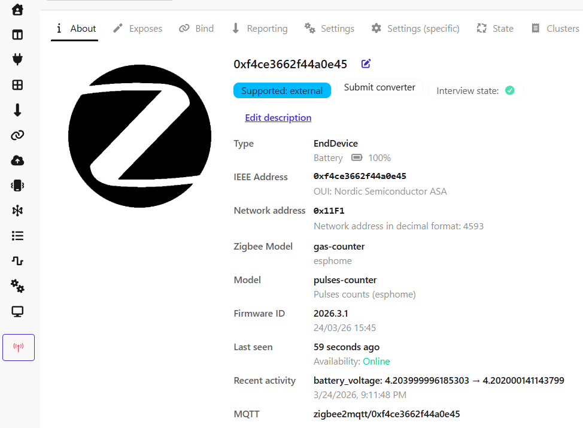
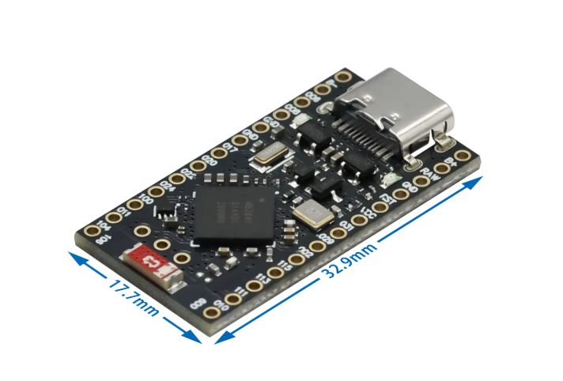
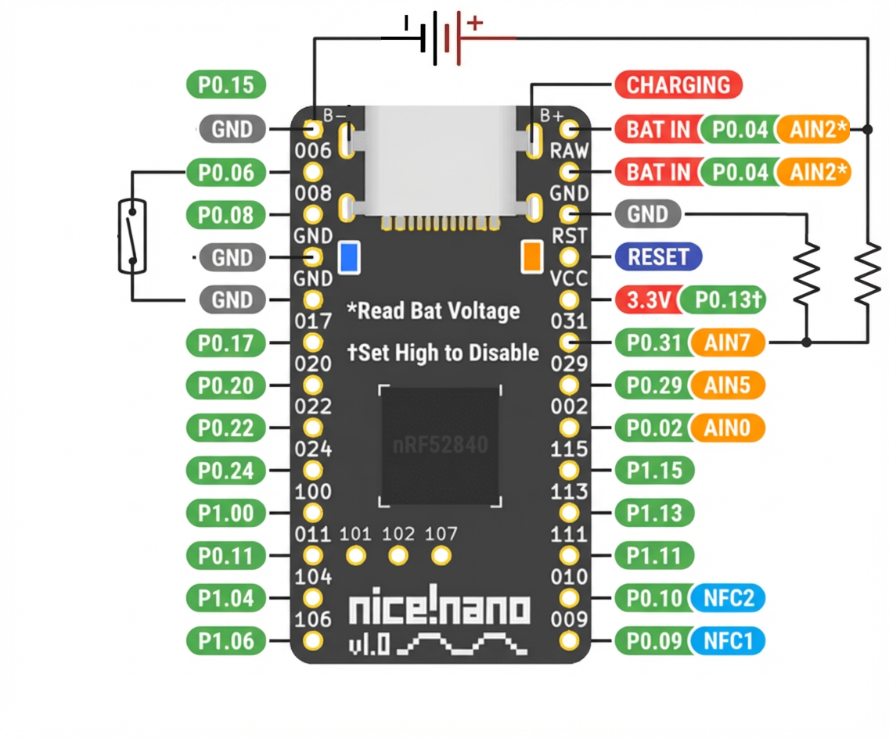
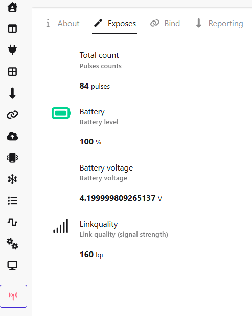

[](https://buymeacoffee.com/romlis)


# nRF52840 Pulse Counter with Zigbee2MQTT

**nRF52840-based pulse counter** that counts pulses from utility meters with magnetic impulse output and sends data to **Zigbee2MQTT**.  

---

## 🚀 Quick Start  

1. Copy the external converter to Zigbee2MQTT.  
   👉 See [External Converter](./zigbee2mqtt/)  
2. Restart Zigbee2MQTT completely (full restart required).  
3. Enable Zigbee pairing (**permit join**)  
4. Flash the firmware onto your nRF52840 Supermini board.  
5. Create Home Assistant helper.  

---

## ⚠️ Power Notes  

- The P0.04 pin operates at VDD levels (typically **3.3V**).  
- The pin P0.04 is **NOT 5V tolerant**.  
- Use a voltage regulator or voltage divider if needed.  
- Can also be **powered from USB** (3.3V internally regulated).  

---

## ✨ Features
  

- Counts pulses from a source using a reed sensor connected to the board. 
- Stores pulse count in **non-volatile memory (NVS)**.  
- Sends data to **Zigbee2MQTT**.  
- LED indication for battery charging.  

---

## 🔧 Hardware
  

- [nRF52840 Supermini board](https://www.aliexpress.com/item/1005008965369485.html)  
- Utility meter with pulse output (e.g., BK-G4MT, Honeywell BK-G6M or similar)  
- Reed sensor (<20 AT recommended, **Normally Open (NO)**) 
  - tested with [GPS-01 Reed Switch 4×18](https://www.aliexpress.com/item/1005007756163643.html) (not sensitive enough)  
- [Battery power supply](https://www.aliexpress.com/item/1005009442666781.html) (tested with 18650 ⚠️use at your own risk)
  - (supports USB-C power banks)  

---

## 📦 Software Requirements

- [**Zigbee2MQTT**](https://www.zigbee2mqtt.io/) with external converter configured  
- [EspHome](https://esphome.io/)  
- [MQTT broker](https://mosquitto.org/)  
- [Home Assistant](https://www.home-assistant.io/) server  

---

## 🔌 Wiring Example

| nRF52840 Pin | Connection            |
|--------------|-----------------------|
| P0.06        | Reed sensor signal    |
| GND          | Reed sensor GND       |
| P0.04        | +VDD (+3.3V)          |
| GND          | -VDD (-3.3V)          |
|              |                       |



---

## 🚀 How It Works

1. nRF52840 Supermini counts pulses from the source.  
2. Pulses are stored in **NVS flash** to survive power loss.  
3. The counter value and battery voltage are sent to **Zigbee2MQTT**.  

  

## 🏠 Home Assistant Configuration

To correctly interpret the counter values as gas consumption, create a Helper in Home Assistant **Settings → Devices & services → Helpers → Create helper → Template → Sensor** with the following parameters.
> `5720.17` - is the initial reading of your utility meter.  
> `sensor.0xf4ce3662f44a0e45_total_count` - your sensor entity in Home Assistant.  

### 📊 Template
```yaml
Name: Gas meter
State: {{ (states('sensor.0xf4ce3662f44a0e45_total_count') | float(0) * 0.01 + 5720.17) | round(2) }}
Device class: Gas
State class: Total increasing
Unit of measurement: m³
```
---

## ⚡ Installation  

### ⚠️ Don't forget to create an [external converter](./zigbee2mqtt/) in Zigbee2MQTT first!  

```bash
- git clone https://github.com/romlisrl/nRF52PulseCounter
- cd nRF52PulseCounter
- esphome compile gas-counter.yaml
- adafruit-nrfutil dfu serial --package .\firmware.zip -p COM15 -b 115200 
```
or  
>- uf2conv.py firmware.hex -c -o firmware.uf2 (copy UF2 file to the board in DFU mode)  

---  
## 📝 Notes

- Make sure the Zigbee coordinator is running and **permit join is enabled**
- After modifying the external converter, **restart Zigbee2MQTT completely** (do not use *Settings → Tools → Restart Zigbee2MQTT*)
